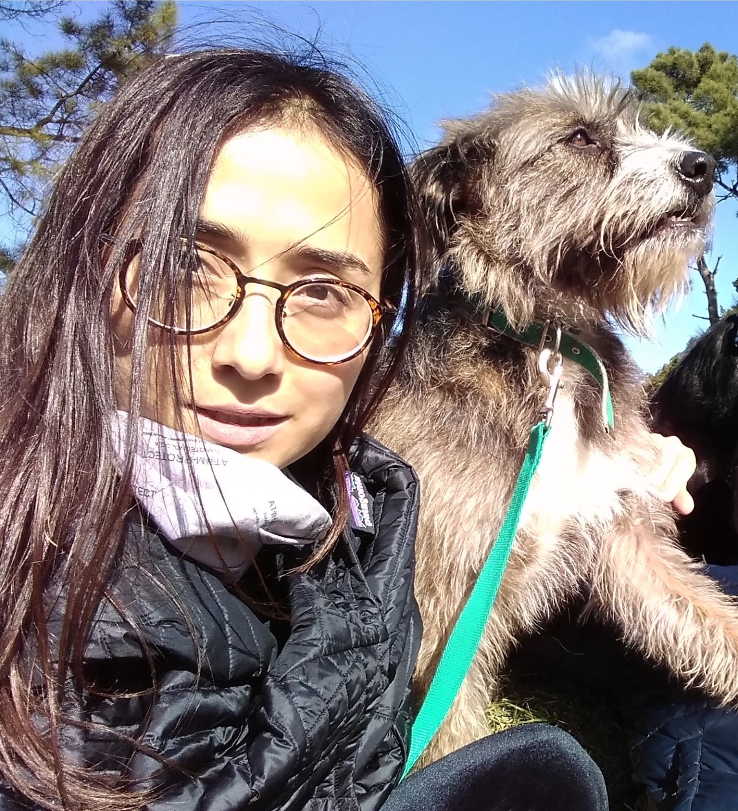
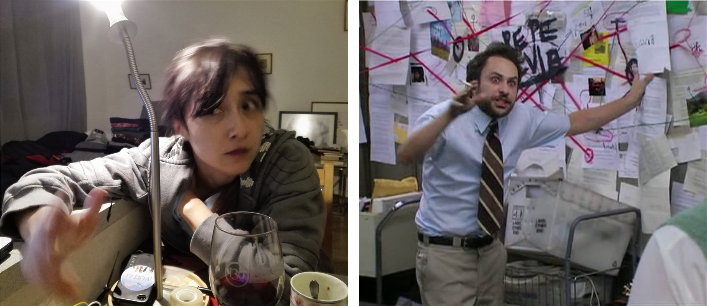

# ¡Bienvenida Paz!

En enero de 2022, compartimos que [buscábamos un/a investigadora comunitaria y  coordinadora de programas](https://openlifesci.org/posts/2022/02/18/ols-is-hiring/) para unirse a nuestro equipo, gracias al apoyo [del Fondo de Investigación Abierta Wellcome](https://openlifesci.org/posts/2021/12/21/wt-open-research-fund/).

__¡Hoy estamos emocionadas y más que emocionadas de dar la bienvenida (oficialmente) a Paz Bernaldo al equipo organizador de OLS!__  :raised_hands:

¡Estamos muy agradecidas de que se una a nuestro equipo y esperamos aprender más de ella! ¡Sigue leyendo para aprender sobre Paz en sus propias palabras!

_La ciencia abierta se me apareció como algo en 2017, cuando conocí a personas que parecían sentir lo mismo que yo había sentido durante mucho tiempo en torno a  la ciencia, como prácticas y sistemas que necesitaban con urgencia un cambio radical. Se trataba de un cambio sistémico, incluso revolucionario, pensé entonces (y continúo pensando) pero también de cambios que se sintieran manejables, como por ejemplo el de producir herramientas físicas (hardware) abiertas para que muchas y muchos más puedan hacer ciencia. Me uní así a una comunidad grande y diversa de personas que quieren  transformar la ciencia, que quieren lidiar con las muy complejas preguntas  de quién decide; quién decide quién decide; y quién decide quién decide quién decide :).

Trabajé en un proyecto que intentó cuestionar quién puede participar en los procesos científicos y en qué capacidad, a quién se le llama "colaborador" y quién decide cuáles son los problemas en primer lugar. Ese proyecto se llamó [Vuela](https://vuela.cc/) y primero copiamos y luego modificamos un dron de código abierto (Go Open Hardware!) con la ayuda de muchos sospechosos habituales (como investigadores, entusiastas de la ciencia abierta) pero también muchos sospechosos bastante inusuales como inmigrantes adultos que nunca pisaron una universidad.

Mi formación académica formal es humanidades y ciencias sociales, por lo que no sorprende que los temas de gobernanza, poder e inequidad en la creación y el intercambio de conocimientos sean los que más me motivan. Postulé a OLS precisamente porque estos temas les importan y porque trabajan directamente para crear comunidades que se sientan no solo abrumadas por el tamaño de la transformación esperada, sino también listas y capaces de trabajar colectivamente para el cambio sistémico necesario._

Paz ha estado trabajando con nosotros durante el último mes, primero liderando la colaboración de OLS con el Instituto Alan Turing para re-empaquetar y poner a disposición para quien los necesite, los  materiales de capacitación de OLS ([ver propuesta] (https://zenodo.org/record/ 6974060)), y jugando un papel crucial en el impulso de la organización y coordinación de OLS-6.

En los próximos 2 años, Paz actuará como coordinadora clave de las cohortes de OLS. Además, liderará la investigación para evaluar el impacto a largo plazo de capacitaciones y tutorías contextuales (utilizando OLS como un estudio de caso),  construyendo una base de evidencia sobre prácticas que han resultado efectivas en la capacitación en investigación abierta y el desarrollo comunitario. Trabajará en estrecha colaboración con las directoras de OLS, así como con las y los pasados ​​y presentes líderes, mentores, facilitadores, expertes y socies del proyecto OLS (consulta nuestra [propuesta del Wellcome Open Research Fund ] (https://zenodo.org /record/5267934) para más detalles).

Puedes conectarte con Paz en Twitter ([PazByC] (https://twitter.com/PazByC)) y [siga OLS] (https://twitter.com/openlifesci) para recibir futuras noticias.

