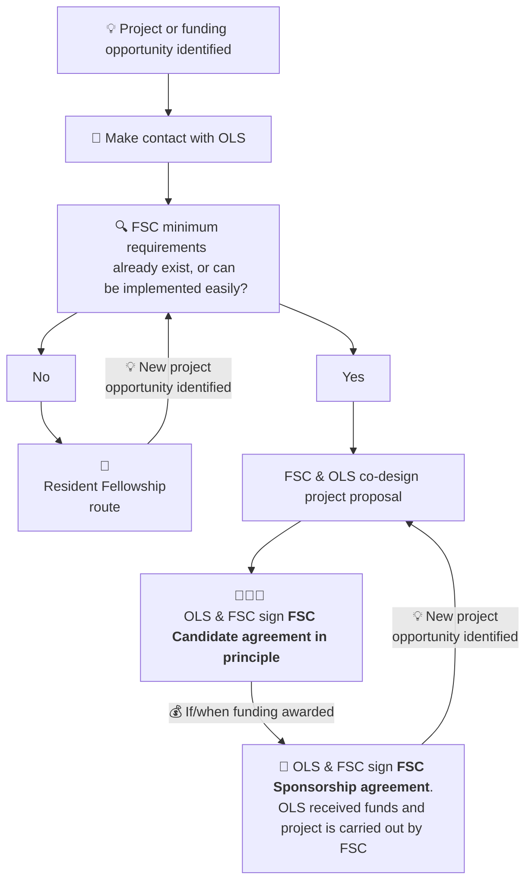

# OLS Fiscally Sponsored Community (FSC) Onboarding process

As part of OLS's commitment to growing open researchers, OLS is experimenting with offering Fiscal Sponsorship. This model is well-known in the United States, with sponsors such as [Numfocus](https://numfocus.org/) and [Code for Science and Society](https://www.codeforsociety.org/) existing as nonprofit organisations that offer fiscal sponsorship for their constituent communities. 

Communities that have participated in an OLS training cohort, or worked with OLS in other capacities, are welcome to apply to become a fiscally sponsored community ([FSC](#fsc)). 

## FAQ

### I would like to apply to become an OLS FSC. What do I need to do? 
Please email [{{ site.email|replace:'@','[at]' }}](mailto:{{ site.email }}) to discuss your options, or message a director in Slack. 

### Are there any minimum requirements for becoming an FSC? 
There are! Please see our policies, procedures, and docs page for the details. If you think you can't yet meet those requirements, we're still happy to chat - we might want to consider working with you as part of a **resident fellowship** instead. If you're thinking of applying for a grant opportunity, please contact OLS with as _much_ time in advance as possible before you submit the grant application, so we can offer advice and help verify that the budget works for us and for you. 

### I've never applied for a grant before! Do you have any advice?

Definitely! In fact, we prefer to work hand-in-hand with our new FSCs and resident fellows when they are applying for their first funding rounds. 

### Does it cost anything to be an FSC? 
Nothing up-front. If you're awarded any grants, we usually ask for a fee of around 15% of the incoming sum. This helps us pay our program officers who manage the finance, as well as covering costs like legal and accounting. There are scenarios where this number may vary though, depending on the grant requirements. 

### What does the FSC onboarding process look like? 

## Definitions
### FSC
**Fiscally sponsored community:** A group of individuals with interest in open research or other OLS-adjacent domains that would like assistance handling money, contracts, and possibly employment.

# Current Fiscally Sponsored Communities (FSC)



    
    
    


