# OLS Fiscally Sponsored Community (FSC) Onboarding process

As part of OLS's commitment to growing open researchers, OLS is experimenting with offering Fiscal Sponsorship. This model is well-known in the United States, with sponsors such as [Numfocus](https://numfocus.org/) and [Code for Science and Society](https://www.codeforsociety.org/) existing as nonprofit organisations that offer fiscal sponsorship for their constituent communities. 

Communities that have participated in an OLS training cohort, or worked with OLS in other capacities, are welcome to apply to become a fiscally sponsored community ([FSC](#fsc)). 

## FAQ

### I would like to apply to become an OLS FSC. What do I need to do? 
Please email [{{ site.fsc_email|replace:'@','[at]' }}](mailto:{{ site.fsc_email }}) to discuss your options, or message the FSC team in Slack. 

### Are there any minimum requirements for becoming an FSC? 
There are! Please fork the [FSC community template repo](https://github.com/open-life-science/fiscally-sponsored-community-templates), which should guide you through creating issues as to-dos for the basic docs we expect. [You can also read our internal policy page for FSCs]()

The TL;DR version of the requirements are: 

- At least **three senior members** who are responsible for organisational governance.
- A **dispute resolution process** (OLS will not resolve disputes on your behalf).
- A **succession policy** - e.g. what happens if key project members leave or become unresponsive / unavailable for some reason. 

If you think you can't yet meet those requirements, we're still happy to chat - we might want to consider working with you as part of a **resident fellowship** instead. 

If you're thinking of applying for a grant opportunity, please contact OLS with as _much_ time in advance as possible before you submit the grant application, so we can offer advice and help verify that the budget works for us and for you. 

### I've never applied for a grant before! Do you have any advice?

Definitely! In fact, we prefer to work hand-in-hand with our new FSCs and resident fellows when they are applying for their first funding rounds. 

### Does it cost anything to be an FSC? 
Nothing up-front. If you're awarded any grants, we usually ask for a fee of around 15% of the incoming sum. This helps us pay our program officers who manage the finance, as well as covering costs like legal and accounting. There are scenarios where this number may vary though, depending on the grant requirements.

### Can an FSC hire people?

Yes. However, there are costs involved in this.

In short, for every £100 of salary, there are £60 of extra costs - giving a total of £160. Salaries should therefore be budgeted at **160%** of the pre-tax cost.

If the person is based in the UK, they will be onboarded as an **OLS employee**. Their salary will break down as follows:
- The pre-tax salary splits into two sets of cost: employee PAYE contributions (National Insurance, income tax, pension contributions, and Student Finance payments) and the money they take home at the end of the month.
- Additionally, we need to budget an extra 60% to pay for employer contributions to tax and pension, as well as additional costs (such as payroll, administrative costs, and insurance).

If the person is based outside of the UK, they will be onboarded as a **contractor**. Their payments will break down as follows:
- They receive a 15% uplift to pre-tax salary. This is because we don't need to cover employer or employee costs in the UK. Contractors must make their own local tax payments. They are encouraged to organise local pensions and insurance.
- Due to the reduced tax and pension burden, we budget 45% for payroll, administrative, and other costs.

The full 160% should be budgeted into all grants. The OLS team can support you with this if needed.

### What does the FSC onboarding process look like? 

```mermaid!
graph TD;
    Idea[💡 Project or funding opportunity identified]-->Contact["📧 Make contact with OLS"];

    Contact-->MIN;

    MIN-->No;

      No-->ResidentFellow[👤 
    Resident Fellowship 
    route];


     MIN["🔍 FSC minimum requirements 
    already exist, or can 
    be implemented easily?"]-->Yes
    
    Yes-->Proposal

    Proposal[FSC & OLS co-design project proposal]-->FSCinPrinciple
   
    
  FSCinPrinciple["`👥👥👥 
    OLS & FSC sign **FSC Candidate agreement in principle**`"];
    
    FSCinPrinciple-- "💰 If/when funding awarded" -->FSCAgreed["`📝 OLS & FSC sign **FSC Sponsorship agreement**.
    OLS received funds and project is carried out by FSC`"];
    
    FSCAgreed-- 💡 New project 
    opportunity identified -->Proposal
    
    ResidentFellow-- 💡 New project 
    opportunity identified --->MIN
   
```

## Definitions
### FSC
**Fiscally sponsored community:** A group of individuals with interest in open research or other OLS-adjacent domains that would like assistance handling money, contracts, and possibly employment.

# Current Fiscally Sponsored Communities (FSC)



    
    
    


