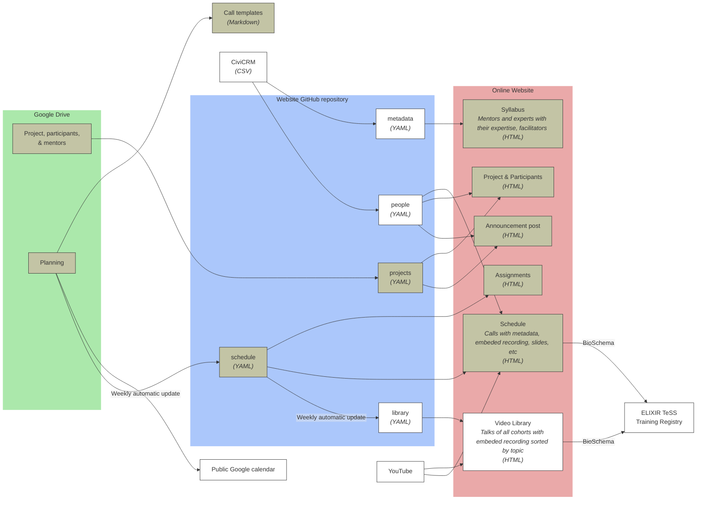

Our knowledge about our different programs, our community, etc is managed via repositories in a [GitHub organization]({{ site.owner_url }}), [CiviCRM](https://civicrm.org/), and documents stored in Google Drive.

# Management for Open Science Training cohorts

To organize calls in the different cohorts, we use a shared Spreadsheet containing information about calls: general information like date, time, learning objectives, but also the different activities like talks, group discussions with instructions. This spreadsheet also contains links to full recordings, slides, information about speakers.

We developped scripts for limiting manual work to propagate the information from the spreadsheet but also information about speakers to the OLS website in order to centralize the information there, build the video library. The script also generates templates for the call notes, and add information about participants, projects, and mentors in a cohort. 



## Prepare a cohort

### Prepare infrastructure for a new cohort

### Add possible mentors and experts with their expertise

1. Get a CSV file from CiviCRM  using the predefined fields for website
2. Prepare computational environment (locally or GitPod) as explained in the `README.md` file of the GitHub repository
3. Run the script which extract information from the CSV file and add them to `_data/people.yaml`:

    ```
    $ python bin/prepare_website_data.py addmentorsexperts \
        -c <cohort id> \
        -t <mentors or experts> \
        -df <path to csv file with participants> OR -du <URL to csv file with participants>
    ```

4. Run the script which sort expertise and save information in metadata file:

   ```
   $ python bin/prepare_website_data.py sortexpertises -c <cohort id>
   ```

5. Submit changes by creating a Pull Request

### Prepare planning spreadsheet and connect it to the website

1. Make a copy of the planning spreadsheet of a previous cohort on Google drive

    The spreadsheet should include a sheet with the following columns: 
    
    Column name | Expected content
    --- | ---
    `Week` | 
    `Start Date` | 
    `Start Time` | 
    `End Date` | 
    `Duration` | 
    `Title` | 
    `Type` | 
    `Tag` | 
    `Call lead` | 
    `Note link` | 
    `Possible speaker` | 
    `Confirmed speaker` | 
    `Slides` | 
    `Recording` | 
    `Learning objectives` | 
    `Before` | 
    `Icebreaker` | 
    `After` | 
    `Instructions` | 
    `People per room` | 

2. Make the speadsheet readable by anyone with the link
3. Copy the link
4. Open `bin/update_schedule.sh` script
5. Add new lines

    ```
    echo "OLS-<cohort id>"
    python bin/prepare_website_data.py \
        updateschedule \
        --cohort '<cohort id>' \
        --schedule_url "<copied link where 'edit?usp=sharing' is replaced by 'export?format=csv&gid=' and then the id of the sheet in the spreadsheet"
    ```

3. Submit changes by creating a Pull Request

### Update the schedule on GitHub

This is run automatically every week and subitted as a Pull Request. The explanations below are only to run it manually

1. Prepare computational environment (locally or GitPod) as explained in the `README.md` file of the GitHub repository
2. Run the script `bin/update_schedule.sh`

    ```
    $ bash bin/update_schedule.sh
    ```

3. Submit changes by creating a Pull Request

### Add information to the public Google calendar

#### Add calls

1. Create in the planning spreadsheet a sheet:

    1. Filtering rows in the main sheet to get only the ones where the type is `(Cohort|Skill-up|Q&A|Cafeteria)` (using `=FILTER('Main sheet'!A6:A142, REGEXMATCH('Main sheet'!G6:G142, "(Cohort|Skill-up|Q&A|Cafeteria)"))`)
    2. Having the columns: 

        Column name | Expected content
        --- | ---
        `Week` | `Week` column of main sheet
        `Type` | `Type` column of main sheet
        `Topic` | `Title` column of main sheet
        `Optional`  | `(optional)`if Q&A or `(optional for mentors)`
        `Subject` | Concatenation to get something like "[`Type` Call] Week `Week` - `Subject` (`Optional`) [Lead: `Lead`]"
        `Start Date` | `Start Date` column of main sheet 
        `Start Time` | `Start Time` column of main sheet or another column with the time at the same timezone than the Google calendar
        `End Time` | `End Time` column of main sheet  or another column with the time at the same timezone than the Google calendar
        `Note link` | `Note link` column of main sheet
        `Description` | Concatenation to get 3 lines with link to note, link to time zone and link to schedule on website
        
2. Download the sheet as CSV
3. Add events to [Google calendar](https://support.google.com/calendar/answer/37118#advanced&zippy=%2Ccreate-or-edit-a-csv-file).

#### Add weeks

1. Create in the planning spreadsheet a sheet
    1. Filtering rows in the main sheet to get only the ones where the type is `Week` (using `=FILTER('Main sheet'!A6:A142, REGEXMATCH('Main sheet'!G6:G142, "Weeks"))`)
    2. Having the columns: 

        Column name | Expected content
        --- | ---
        `Week` | `Week` column of main sheet
        `Start Date` | `Start Date` column of main sheet 
        `End Date` | `Start Date`$ + 6$
        `All Day Event` | `TRUE`
        `Description` | Concatenation to get something like "OLS-N - Week `Week`"

### Add project, participants, and mentors

1. Get a CSV file with the following information
   - `Title`
   - `Mentor 1`
   - `Authors`
   - `Project-description`
   - `Comment regarding review` (with `rejected` if needed)
   - `Keywords`

2. Get a CSV file from CiviCRM  using the predefined fields for website with participant information

3. Prepare computational environment (locally or GitPod) as explained in the `README.md` file of the GitHub repository

4. Run the script which extracts project information from a CSV file and add them in project file:

   ```
   $ python bin/prepare_website_data.py addprojects \
      -c <cohort id> \
      -pf <path to csv file with projects> OR -pu <URL to csv file with projects> \
      -df <path to csv file with participants> OR -du <URL to csv file with participants>
   ```

5. Submit changes by creating a Pull Request

### Generate call templates

1. Make sure the planning spreadsheet is up-to-date with talks, speakers, activities (breakouts, silent reflection), learning objectives, icebreaker, etc
2. Open `bin/create_call_templates.sh` script
3. Make sure the link there corresponds to the spreadsheet
4. Prepare computational environment (locally or GitPod) as explained in the `README.md` file of the GitHub repository
5. Run the script `bin/create_call_templates.sh`

    ```
    $ bash bin/create_call_templates.sh
    ```  

6. Submit changes to call templates in the cohort Github repository