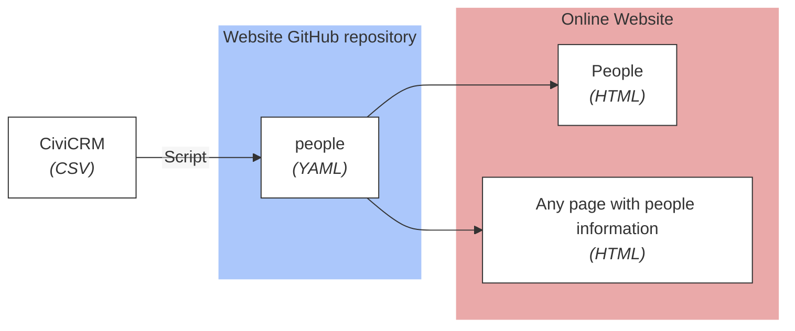
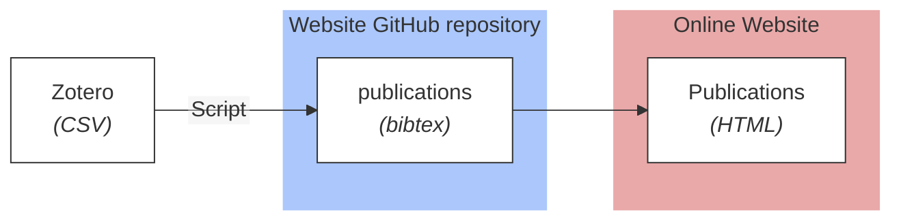
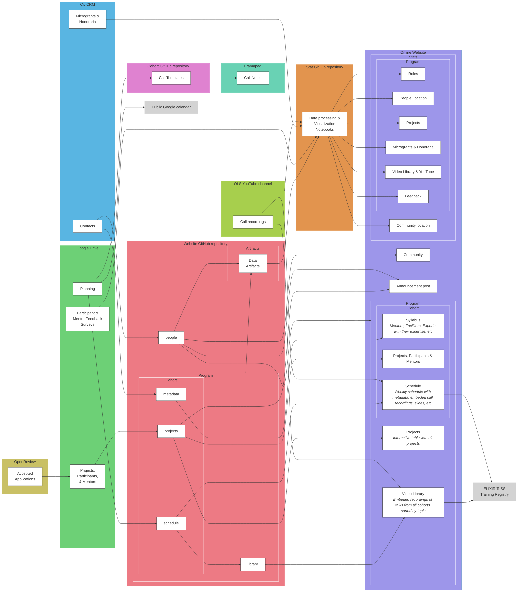
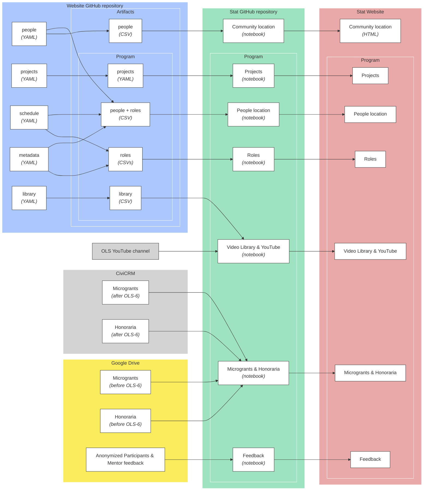

Information and data about our different programs, our community, etc are managed via repositories in a [GitHub organization]({{ site.github.owner_url }}), [CiviCRM](https://civicrm.org/), and documents stored in Google Drive.

# OLS community

## Individuals

Individuals who participated in an OLS activity are listed in [People page](). This page is generated from the data stored in the `_data/people.yml` file that are extracted from CiviCRM.



### Add people

1. Get a CSV file from CiviCRM using the predefined fields for website:
   - `First name`
   - `Last name`
   - `Email`
   - `Github username`
   - `Twitter username`
   - `Mastodon username`
   - `Website`
   - `ORCID`
   - `Affiliation`
   - `City`
   - `Country`
   - `Pronouns`
   - `Areas of expertise`
   - `Bio`

2. Prepare computational environment (locally or GitPod) as explained in the `README.md` file of the GitHub repository

3. Run the script which extract information from the CSV file, add them to `_data/people.yaml`, and add extra information about localisation

   ```
   $ python bin/prepare_website_data.py extractpeople \
      -df <path to csv file with people> OR -du <URL to csv file with people>
   ```

4. Submit changes by creating a Pull Request

## Organizations

OLS is supported by several organizations as [funders](#funders), as [supporters](#supporters), or as [partners]().

### Add an organization

1. Open the `_data/organizations.yaml` file
2. Create a new entry there (using the name in lowercase, with spaces replaced by `-`) following an alphabetical order
3. Fill in information using the tags:
    - `name` (mandatory)
    - `website`
    - `logo`

        It can be either an URL to an image or the path to the logo added in `images/organizations` folder

    - `description`
    - `country`

4. Submit changes by creating a Pull Request

### Add a funding

1. Make sure the organization is listed in the `_data/organizations.yaml` file and add it otherwise (see above)
2. Open the `_data/funding.yaml` file
3. Create a new entry there
4. Fill in information using the tags:
    - `funder` using the organization short name from the `_data/organizations.yaml` file
    - `amount` of funding
    - `currency` of funding
    - `duration`
    - `date_award`
    - `purpose`
    - `proposal` with link to the proposal
5. Submit changes by creating a Pull Request

### Add a partner or supporter

1. Make sure the organization is listed in the `_data/organizations.yaml` file and add it otherwise (see above)
2. Open the `_data/community.yaml` file
3. Add a new entry in `partners` or `supporter`
4. Fill in information using the tags:
    - `organization` using the organization short name from the `_data/organizations.yaml` file
    - `details` with description of the support or partnership
5. Submit changes by creating a Pull Request

# Website content, outside community and Open Science Training cohorts

## Publications

All publications by OLS team are aggregated in a [Zotero group](https://www.zotero.org/groups/5292095/publications_by_ols), imported weekly into the GitHub repository and then displayed in a [dedicated page]()



### Add a publication

1. Request membership to the [Zotero group](https://www.zotero.org/groups/5292095/publications_by_ols) 
2. Add publication to the group
3. Wait for weekly update or run the "Update bibliography" [GitHub Action](https://github.com/open-life-science/open-life-science.github.io/actions/workflows/update-bibliography.yml)

## Posts

### Create a new blog post

1. Create a file in the folder `_posts` with a file named following the pattern `yyyy-mm-dd-name.md`
2. Add some metadata on the top of the file

    ```
    ---
    layout: post
    title: <title of the post>
    author: <ID of the authors in people.yml file>
    image: images/yyyy-mm-dd-name.jpg
    ---
    ```

3. Add content of the post to the file in [Markdown](https://www.markdownguide.org/getting-started/)
4. Add images in `images/posts/` directory
5. Submit changes by creating a Pull Request

## Events

We list on the website events either organised by OLS or where we are invited to speak at.

### Add a new event

1. Create a file in the folder `_events` with a file named following the pattern `yyyy-mm-dd-name.md`
2. Add some basic metadata on the top of the file

    ```
    ---
    layout: event
    title: <title of the event>
    type: <conference, workshop or training>
    description: |
        <short description of the event (one or two sentences)>
    
    external: <link to event if external>

    date_start: <starting date of event in YYYY-MM-DD format (e.g., 2024-10-26)>
    date_end: <starting date of event in YYYY-MM-DD format (e.g., 2024-10-26). Optional, if event is more than one day>
    time_start: <time start in HH:MM:SS format and UTC timezone. Optional if daylong event>
    duration: <duration in HH:MM:SS format. Optional if daylong event>

    location:
        name: 

    contributions:

    images:
    ---
    ```

3. Fill in more metadata

    - location:
        
        If online

            ```
            location: 
                name: Online
            ```

        If not online

            ```
            location: 
                geo:
                    lat: 45.78528236218017
                    lon: 4.856445300000001
                name: Online
                city: Lyon
                country: France 
            ```

    - contributions 

        If the event is a **conference** where OLS team and/or the community presented posters and/or talks highlighting OLS:

        ```
        contributions:
            posters:
            - 
                presenters: 
                - <id from people.yaml, one per line>
                title: "<title of the poster>"
                poster: <link to poster>
            talks:
            - 
                speakers:
                - <id from people.yaml, one per line>
                title: "<title of the talk>"
                slides: <link to slides>
        ```

        If the event is a **workshop** or **training** organised by the OLS team and/or the community

        ```
        contributions:
            facilitators:
            - <id from people.yaml, one per line>
            helpers:
            - <id from people.yaml, one per line>
            instructors:
            - <id from people.yaml, one per line>
            organisers:
            - <id from people.yaml, one per line>
            funding:
            - <id from funding.yaml, one per line>

        ```

    - workshop information

        ```
        cost: <free or, e.g. 150 EUR, must be space separated, must include a currency in ISO 4217 format>
        audience: <sentence about the audience>
        contact_email: <contact email>

        registration:
            link: <link for registration> 
            deadline: <date in YYYY-MM-DD format (e.g., 2024-10-26)>
        ```

4. Add content of the event to the file in [Markdown](https://www.markdownguide.org/getting-started/) (below `---`)
4. Add images in `images/events/` directory
5. Submit changes by creating a Pull Request

# Open Science Training cohorts

To organize calls in the different cohorts, we use a shared Spreadsheet containing information about calls: general information like date, time, learning objectives, but also the different activities like talks, group discussions with instructions. This spreadsheet also contains links to full recordings, slides, information about speakers.

We developed scripts for limiting manual work to propagate the information from the spreadsheet but also information about speakers to the OLS website in order to centralize the information there, build the video library. The script also generates templates for the call notes, and add information about participants, projects, and mentors in a cohort. 



## Prepare infrastructure for a new cohort

1. Prepare computational environment (locally or GitPod) as explained in the `README.md` file of the GitHub repository
2. Run the script which create cohort files:

    ```
    $ python bin/prepare_website_data.py createcohort \
        -p <program, e.g. openseeds>
        -c <cohort id>
    ```
   
3. Add organizers in data
    1. Open `_data/openseeds/ols-x/metadata.yaml` 
    2. Update `organizers`

4. Update the cohort timeline
    1. Open `_data/openseeds/ols-x/schedule.yaml` 
    2. Update `timeline` information

5. Update the cohort schedule as explained below
6. Add possible mentors and experts as explained below


## Add possible mentors and experts with their expertise

1. Get a CSV file from CiviCRM  using the predefined fields for website
2. Prepare computational environment (locally or GitPod) as explained in the `README.md` file of the GitHub repository
3. Run the script which extract information from the CSV file and add them to `_data/<program>/metadata.yaml`:

    ```
    $ python bin/prepare_website_data.py addmentorsexperts \
        -p <program, e.g. openseeds> \
        -c <cohort id> \
        -t <mentors or experts> \
        -df <path to csv file with participants> OR -du <URL to csv file with participants>
    ```

4. Run the script which sort expertise and save information in metadata file:

    ```
    $ python bin/prepare_website_data.py sortexpertises \
        -p <program, e.g. openseeds> \
        -c <cohort id>
    ```

5. Submit changes by creating a Pull Request

## Prepare planning spreadsheet and connect it to the website

1. Make a copy of the planning spreadsheet of a previous cohort on Google drive

    The spreadsheet should include a sheet rows with weeks, calls, and activities, with the following columns: 
    
    Column name | Expected content
    --- | ---
    `Week` | Week number, e.g. `00`, `01` - *mandatory for every row*
    `Start Date` | *mandatory for weeks, calls*
    `Start Time` | *mandatory for calls*
    `End Date` | 
    `Duration` | *mandatory for calls, activities*
    `Title` | *mandatory for calls, activities*
    `Type` | Type of information in the row: Week, Call (Mentor-Mentee, Mentor, Cohort, Skill-up, Q&A), Activities (Presentation, Breakout, Welcome, Silent reflections, Panel)
    `Tag` | Tag for presentations, used for the library ([list of tags](https://docs.google.com/spreadsheets/d/1sDJLG8RuoShWUQN78lvx_mghBbGfusdzlb1WwYrCbjk/edit#gid=0)) - *mandatory for a presentation* 
    `Call lead` | Lead of the call - *mandatory for a call* 
    `Note link` | Link to the notes - *mandatory for a call* 
    `Possible speaker` | 
    `Confirmed speaker` | First name and last name - *mandatory for a presentation* 
    `Slides` | Link to slidedecks - *only for presentation*
    `Recording` | Link to recording on YouTube - *mandatory for a call* 
    `Learning objectives` | List of learning objectives (answering "at the end, participants will be able to:") - *mandatory for a call* 
    `Before` | Instructions to do before a call - *only for call*
    `Icebreaker` | *mandatory for a call* 
    `After` | Instructions to do after a call or an activity
    `Instructions` | Instruction for an activity - *mandatory for breakout or silent reflections* 
    `People per room` | Number of people in each breakout room - *mandatory for breakout* 

2. Make the speadsheet readable by anyone with the link
3. Copy the link
4. Open `bin/<program>/update_schedule.sh` script
5. Add new lines

    ```
    echo "OLS-<cohort id>"
    python bin/prepare_website_data.py \
        updateschedule \
        --program '<program>' \
        --cohort '<cohort id>' \
        --schedule_url "<copied link where 'edit?usp=sharing' is replaced by 'export?format=csv&gid=' and then the id of the sheet in the spreadsheet"
    ```

6. Run the script

    ```
    $ bash bin/<program>/update_schedule.sh
    ```

3. Submit changes by creating a Pull Request

## Update the schedule on GitHub

This is run automatically every week and submitted as a Pull Request. The explanations below are only to run it manually

1. Prepare computational environment (locally or GitPod) as explained in the `README.md` file of the GitHub repository
2. Run the script `bin/<program>/update_schedule.sh`

    ```
    $ bash bin/<program>/update_schedule.sh
    ```

3. Submit changes by creating a Pull Request

## Add information to the public Google calendar

### Add calls

1. Create in the planning spreadsheet a sheet:

    1. Filtering rows in the main sheet to get only the ones where the type is `(Cohort|Skill-up|Q&A|Cafeteria)` (using `=FILTER('Main sheet'!A6:A142, REGEXMATCH('Main sheet'!G6:G142, "(Cohort|Skill-up|Q&A|Cafeteria)"))`)
    2. Having the columns: 

        Column name | Expected content
        --- | ---
        `Week` | `Week` column of main sheet
        `Type` | `Type` column of main sheet
        `Topic` | `Title` column of main sheet
        `Optional`  | `(optional)`if Q&A or `(optional for mentors)`
        `Subject` | Concatenation to get something like "[`Type` Call] Week `Week` - `Subject` (`Optional`) [Lead: `Lead`]"
        `Start Date` | `Start Date` column of main sheet 
        `Start Time` | `Start Time` column of main sheet or another column with the time at the same timezone than the Google calendar
        `End Time` | `End Time` column of main sheet  or another column with the time at the same timezone than the Google calendar
        `Note link` | `Note link` column of main sheet
        `Description` | Concatenation to get 3 lines with link to note, link to time zone and link to schedule on website
        
2. Download the sheet as CSV
3. Add events to [Google calendar](https://support.google.com/calendar/answer/37118#advanced&zippy=%2Ccreate-or-edit-a-csv-file).

### Add weeks

1. Create in the planning spreadsheet a sheet
    1. Filtering rows in the main sheet to get only the ones where the type is `Week` (using `=FILTER('Main sheet'!A6:A142, REGEXMATCH('Main sheet'!G6:G142, "Weeks"))`)
    2. Having the columns: 

        Column name | Expected content
        --- | ---
        `Week` | `Week` column of main sheet
        `Start Date` | `Start Date` column of main sheet 
        `End Date` | `Start Date`$ + 6$
        `All Day Event` | `TRUE`
        `Description` | Concatenation to get something like "OLS-N - Week `Week`"

## Add project, participants, and mentors

1. Get a CSV file with the following information
   - `Title`
   - `Mentor 1`
   - `Authors`
   - `Project-description`
   - `Comment regarding review` (with `rejected` if needed)
   - `Keywords`

2. Get a CSV file from CiviCRM  using the predefined fields for website with participant information

3. Prepare computational environment (locally or GitPod) as explained in the `README.md` file of the GitHub repository

4. Run the script which extracts project information from a CSV file and add them in project file:

    ```
    $ python bin/prepare_website_data.py addprojects \
        --program '<program>' \
        -c <cohort id> \
        -pf <path to csv file with projects> OR -pu <URL to csv file with projects> \
        -df <path to csv file with participants> OR -du <URL to csv file with participants>
    ```

5. Submit changes by creating a Pull Request

## Generate call templates

1. Make sure the planning spreadsheet is up-to-date with talks, speakers, activities (breakouts, silent reflection), learning objectives, icebreaker, etc
2. Open `bin/<program>/create_call_templates.sh` script
3. Make sure the link there corresponds to the spreadsheet
4. Prepare computational environment (locally or GitPod) as explained in the `README.md` file of the GitHub repository
5. Run the script `bin/<program>/create_call_templates.sh`

    ```
    $ bash bin/<program>/create_call_templates.sh
    ```  

6. Submit changes to call templates in the cohort Github repository

# Data and stats

Data about the community (e.g. members' location), the cohort (e.g. feedback or roles), and the video library are explored and visualized via Jupyter Notebooks, stored in a [GitHub repository]({{ site.github.owner_url }}/ols-stats/) and rendered in a dedicated [OLS stat website]({{ site.url }}/ols-stats/).



